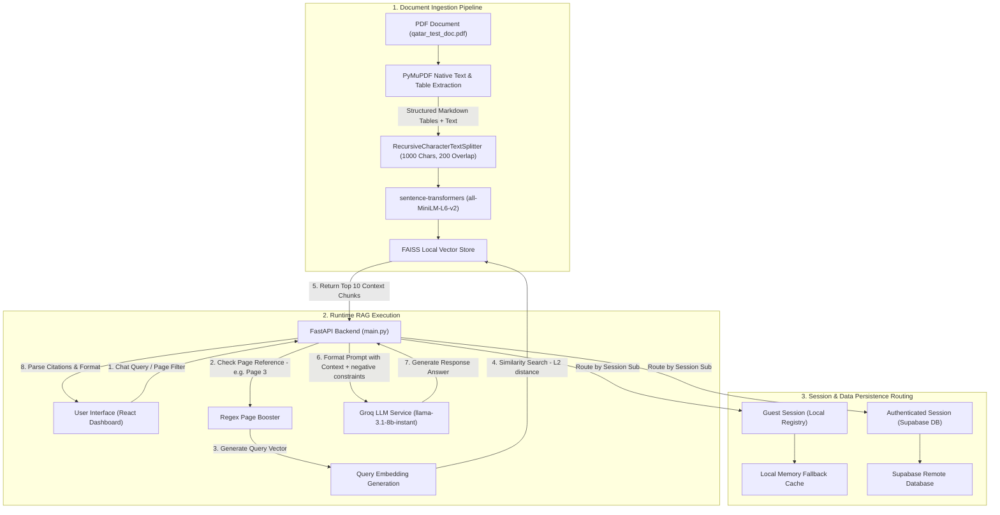

# Multi-Modal Document Intelligence and RAG Pipeline

A production-grade Retrieval-Augmented Generation (RAG) and Document Intelligence pipeline designed to ingest dense financial and macroeconomic PDF reports (such as IMF reports), parse structured text and vector tables natively into Markdown, generate semantic embeddings, and enable context-grounded Q&A with precise page-level citations.

This system features a decoupled, modern web architecture: a React and Vite frontend dashboard and a FastAPI Python backend serving local FAISS vector search and Llama 3.1 LLM generation via Groq.

---

## System Architecture

The following diagram illustrates the document ingestion flow, the runtime RAG execution query path, and the session persistence routing.



---

## Technical Stack

*   **Frontend**: React, Vite, TailwindCSS (for styling, layouts, and animations), Axios
*   **Backend**: FastAPI, Uvicorn, Pydantic, Python-dotenv
*   **RAG Core**: LangChain, FAISS (faiss-cpu), PyMuPDF (fitz), Sentence-Transformers (all-MiniLM-L6-v2), PyTorch, HuggingFace-Hub
*   **Database / Authentication**: Supabase (for persistent storage and user login), Local Memory registry (fallback cache for anonymous guest sessions)
*   **Inference Service**: Groq Cloud API (Llama 3.1 8B Instant)

---

## Core Components

### 1. Ingestion and Document Processor
*   **Native Table Parsing**: PyMuPDF's table finder detects vector line boundaries to parse complex data grids directly into Markdown tables. This keeps values aligned for similarity search without losing structure.
*   **Recursive Splitting**: Text and Markdown tables are chunked using LangChain's `RecursiveCharacterTextSplitter` (chunk size: 1000 characters, overlap: 200 characters) to ensure semantic coherence.
*   **Embedding Model**: Chunks are mapped into 384-dimensional dense vectors using `sentence-transformers/all-MiniLM-L6-v2`.

### 2. Runtime API and Search
*   **Metadata Page-boosting**: Queries referencing a page (e.g., "Page 3") are analyzed via regex in the backend. Chunks belonging to the requested page are boosted directly to the top of the context window.
*   **RAG Prompts and Temperature**: Prompt templates use strict negative constraints ("Answer using ONLY the context... If the answer is not present, say: I cannot find this information..."). The LLM temperature is set to `0.0` to guarantee deterministic and stable outputs.

### 3. Decoupled Persistence Routing
*   **Auth Users**: Conversations, documents, and messages are persisted in a Supabase PostgreSQL database.
*   **Guest Sessions**: Bypasses Supabase network calls completely. Anonymous guest users write and read chat history from a local in-memory registry, eliminating remote database latency.

---

## Setup and Installation

### Backend Prerequisites
1. Ensure Python 3.9+ is installed.
2. Install dependencies:
   ```bash
   pip install -r backend/requirements.txt
   ```
3. Create a `.env` file inside the `backend/` directory:
   ```env
   GROQ_API_KEY=your_groq_api_key
   SUPABASE_URL=your_supabase_project_url
   SUPABASE_ANON_KEY=your_supabase_anon_key
   SUPABASE_SERVICE_KEY=your_supabase_service_key
   SUPABASE_JWT_SECRET=your_supabase_jwt_secret
   ```

### Frontend Prerequisites
1. Ensure Node.js 18+ is installed.
2. Install dependencies:
   ```bash
   cd frontend
   npm install
   ```
3. Create a `.env` file inside the `frontend/` directory:
   ```env
   VITE_API_URL=http://127.0.0.1:8000
   ```

---

## Running the Application

### 1. Rebuild the Document Vector Store Index
To re-process the PDF report and generate the local FAISS index file:
```bash
python run_pipeline.py
```
This runs the ingestion steps in sequence: directory configuration, table/text extraction, recursive splitting, and FAISS database encoding.

### 2. Start the FastAPI Backend
```bash
cd backend
uvicorn main:app --reload --host 127.0.0.1 --port 8000
```

### 3. Start the Vite Frontend Development Server
```bash
cd frontend
npm run dev
```
Open your browser and navigate to `http://127.0.0.1:5173/dashboard`.

---

## Production Deployment

### Frontend (Vercel)
1. Link your GitHub repository to Vercel.
2. Set the root directory to `frontend/`.
3. Set the build command to `npm run build` and output directory to `dist`.
4. Add the environment variable `VITE_API_URL` pointing to your deployed backend.

### Backend (Render or Railway)
To prevent serverless spin-down latency (where cold-starts would download the model weights and load the FAISS index files on every request), deploy the backend on a stateful web service:
1. Connect your repository to Render or Railway.
2. Set the root directory to `backend/`.
3. Build Command: `pip install -r requirements.txt`
4. Start Command: `uvicorn main:app --host 0.0.0.0 --port 10000`
5. Configure your Supabase and Groq environment variables in the service dashboard.
